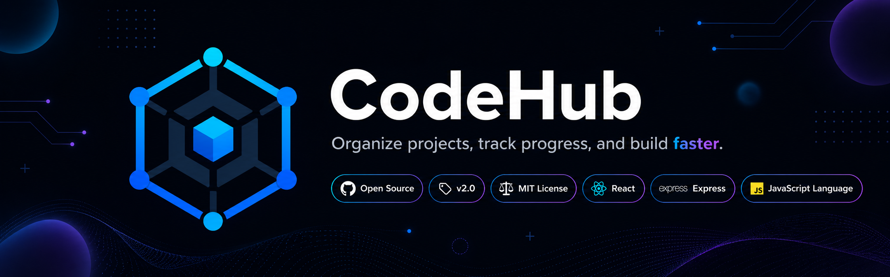
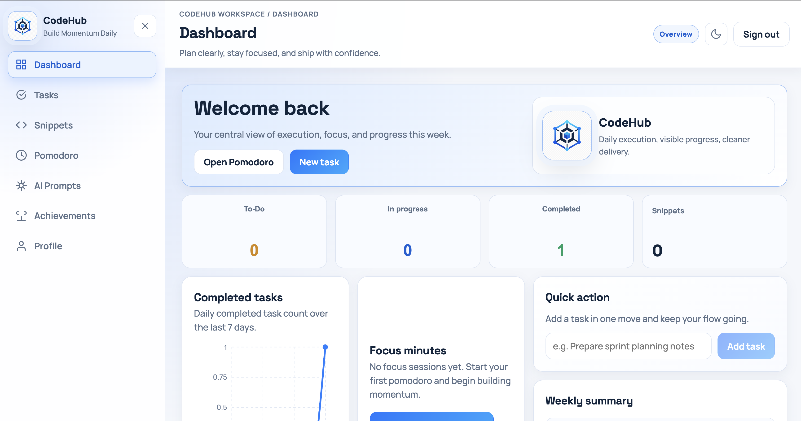
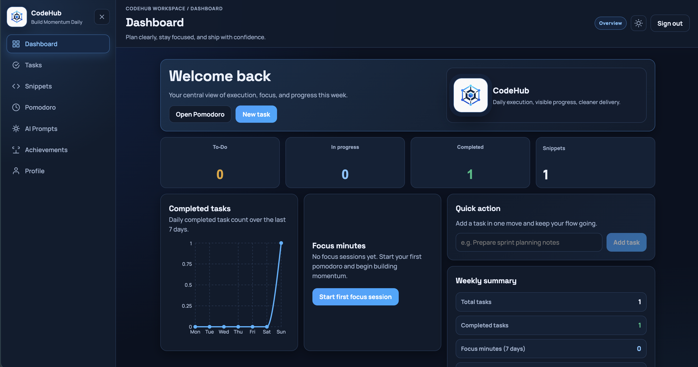
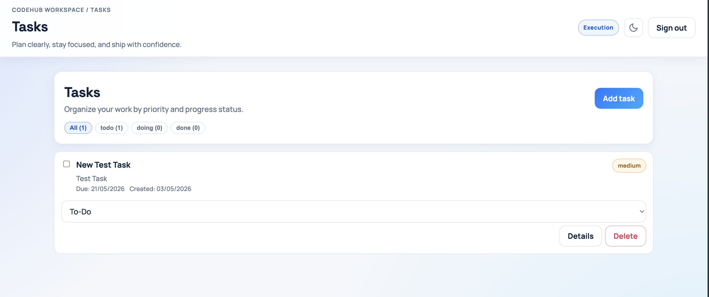
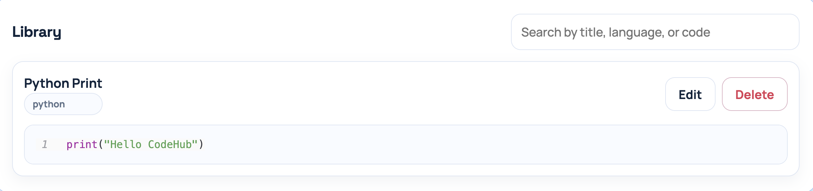
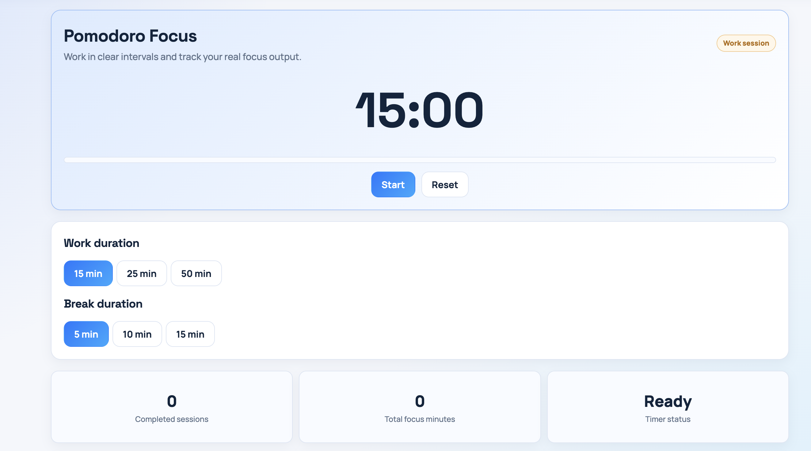
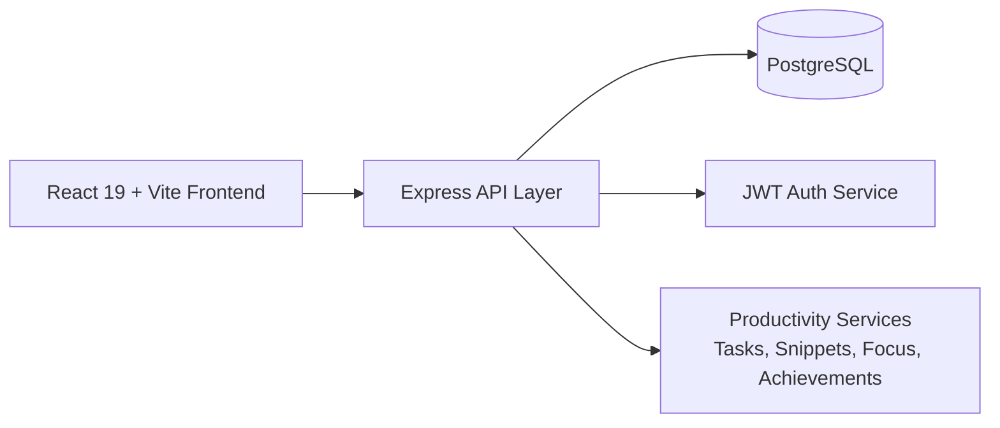

<p align="center">
  
</p>

<h1 align="center">CodeHub</h1>
<p align="center"><strong>Organize projects, track momentum, and ship faster with focus.</strong></p>

<p align="center">
  
  
  
  
  
  
  
</p>

## What Is CodeHub?
CodeHub is a developer productivity workspace built to keep execution clear and fast.
It combines task management, snippet organization, Pomodoro focus sessions, and achievement-driven motivation into one smooth flow.

You can plan your day, stay in focus blocks, track momentum, and keep reusable code close, without juggling multiple tools.

## Technical Improvements In This Release
This release introduces a full frontend stabilization plus backend architecture hardening.

- Refactored UI structure into a consistent design system with shared layout, spacing, and reusable component classes.
- Reworked key pages (`Dashboard`, `Tasks`, `Snippets`, `Pomodoro`, `Achievements`, `Profile`) to reduce inline styles and improve maintainability.
- Integrated route-level lazy loading in the app router to reduce initial bundle pressure and improve startup behavior.
- Optimized syntax highlighting by switching to selective language registration instead of shipping heavier default parsing paths.
- Normalized auth state handling (`useSyncExternalStore` flow + storage synchronization) for more predictable login/logout behavior.
- Fixed linting and state management issues across the frontend and validated production build output.
- Added project asset structure for branded docs visuals (`docs/assets`) and app identity consistency.
- Hardened backend request lifecycle with centralized error handling, structured validation, and stronger API security middleware.
- Added Prisma foundation (`schema.prisma`, baseline migration, and generate/migrate scripts) for safer future schema evolution.

## Core Experience
- **Dashboard Command Center**: quick overview of work, focus, progress, and momentum.
- **Task Flow**: create, prioritize, filter, and complete work with less friction.
- **Snippet Library**: save and retrieve high-value code instantly.
- **Focus Engine**: Pomodoro cycles with tracked focus minutes.
- **Achievement Layer**: visible progress markers that encourage consistency.

## UI Preview
### Dashboard Theme Comparison
| Light Theme | Dark Theme |
| --- | --- |
|  |  |

### Feature Screenshots
#### Tasks


#### Snippets


#### Pomodoro


## Architecture At A Glance
CodeHub follows a clean full-stack structure with a React client, Express API, and PostgreSQL persistence.



### Project Layout
```text
codehub-fullstack-main/
├── codehub-react/      # Frontend app (React + Vite)
├── server/             # Backend API (Express + PostgreSQL)
├── docs/assets/        # README visual assets
├── docker-compose.yml  # Local PostgreSQL container
└── package.json        # Root scripts (dev, db, build)
```

## Getting Started
### Full Docker (Frontend + Backend + Database)
Run everything with one command:

```bash
npm run docker:up
```

Stop all containers:
```bash
npm run docker:down
```

Follow logs:
```bash
npm run docker:logs
```

If your local ports are already in use, run Docker on custom ports:
```bash
BACKEND_PORT=3002 FRONTEND_PORT=5174 npm run docker:up
```

### 1. Install dependencies
```bash
npm run install:all
```

### 2. Start PostgreSQL
```bash
npm run db:up
```

### 3. Initialize schema and demo data
```bash
npm run db:setup
```

### 3.5 Generate Prisma client
```bash
cd server
npm run prisma:generate
```

### 4. Run frontend + backend
```bash
npm run dev
```

### Local URLs
- Frontend: `http://localhost:5173`
- Backend: `http://localhost:3001`

## Demo Access
- Username: `demo`
- Email: `demo@example.com`
- Password: `demo123`

## Environment Setup
Create local environment files from the examples:

- Root example: `.env.example`
- Server example: `server/.env.example`

Recommended first step:
```bash
cp .env.example .env
cp server/.env.example server/.env
```

## Mini Roadmap To Full Release
### Phase 1: Product Hardening
- Finalize profile update and password-change backend endpoints.
- Add end-to-end validation on task, snippet, and focus flows.
- Add release-ready error states and empty-state UX copy.

### Phase 2: Team-Ready Productivity
- Add project/workspace grouping and multi-board task views.
- Add collaboration-ready task metadata (owners, labels, deadlines).
- Add richer analytics with trends and weekly performance snapshots.

### Phase 3: Scale and Platform
- Introduce notifications and reminder automation.
- Add export/import workflows for productivity history.
- Prepare deployment templates and production observability layer.

## Release Note
CodeHub has been fully refreshed in this iteration (v2.0 level update), with major UX, frontend architecture, and stability improvements.

## Final Note
<p align="center">
  
</p>
<p align="center"><strong>CodeHub is built for momentum. Keep building.</strong></p>
